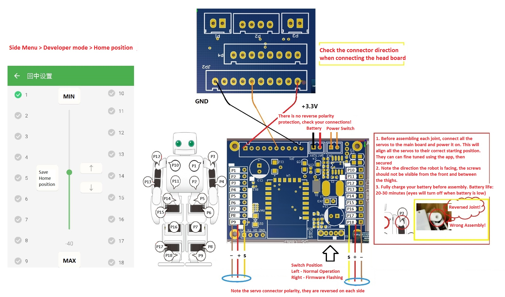

##Before you begin

* Battery
	1. Please first fully charge the battery pack. The battery charger indicator light will turn from red to orange to green when fully charged. Ensure the polarity is correct when connecting the battery to the charger. Each battery pack has two sets of wires/connectors, one is for connecting and powering the robot, the other is for charging the battery.

	2. During operation, the robot's LED eyes will turn off when the battery level is too low. Please recharge the battery at that time.

* App
	1. You can find the app for by searching for "jrobot" in the app store for iOS, and on  for Android.
	2. The side menu of the app contains additional help information and settings.

* Network Settings
	1. First switch off the power on the robot, then enter your home netowrk's WiFi SSID and password (by pressing the + icon on the top right). Switch on the robot and immediately press the "config" button, then wait 30 seconds. Upon connecting, Android users will see connection results, while iOS users will not, and require to manually return to settings view. You ca then return to the main view to scan for your robot and establish the connection.
	2. If you do not have a home WiFi network, switch on the robot and wait for 30 seconds. The robot will leave connection mode and create it's own WiFi hotspot. You can then connect to the robot's WiFi hotspot with your phone (SSID: Jrobot***** Password: 12345678xyz). Once WiFi is connected, you can then scan for your robot and connect to it.

* Servo Centering
	1. The servos have a range of < 180 degrees and they are not always centered to 90 degrees out of the box. Every robot joint's starting angle is not the same either **you must first center all the servos before assembly!**
		1. Switch off the board
		2. Connect every servo according to their joint number
		3. Switch on the board, the servos will automatically align to their starting position
		4. Switch off the board, and begin assembling your robot's joints
		5. Switch on the board and connect with the app, on the side menu, enter "Developer mode" => "Home position" to fine tune the joint servo positions. Once tuned, remember to press the "Home position" button to save your settings.

* Servo Preparation
	1. Each servo has two mounting tabs on its side. Remove them and ensure the sides are as flat as possible. Remove all the stickers.
	2. The joint servos are anchored to the 3D printed parts with the servo horns and bearings. Push them flat into positon and secure the servos.

* Main Board
	1. The firmware has already been flashed and updated on the board, including the animation settings. It is ready to use out of the box. Please do not manually update the firmware unless you are familiar with the firmware code and have made changes.
	2. The 3 pin connector to the head board can inserted vertically (it will not fit horizontally)

* Assembly
	1. Order of assembly
		1. Chest (4 servos)
		2. Battery pack
		3. Head
		4. Head board
		5. Main board
		6. Arms (attached to body). At this time, also fine tune the servo positions so the arms are hanging narturally beside the body
		7. Legs. At this time, also fine tune the servo positions so the robot is standing in a natural upright position
	2. Refer to the assembly instructions pdf for further details, or reference the official Plen2 robot's assembly instructions 

* Connection Diagram
	1. Please refer to this diagram for the pin connections and servo/joint numbering. You can ignore the board's silkscreen printings as the numbering may have changed.

	
